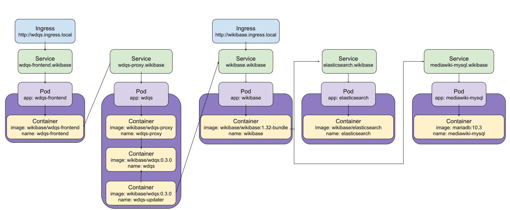

# Minikube Wikibase

A piece of infrastructure like wikibase touches on many different concerns. We need to deploy, manage, and scale disparate pieces of wikibase in different ways. The pieces may be packed in containers but still need to be coordinated. We wish to span some pieces over many servers while looking like one single unit to other pieces. Managing persistent storage is a distinct problem from managing the computational resources.

There are many technical solutions for managing each of the concerns of applications, computational resources, and storage resources. Kubernetes provides a single, common solution to these common problems.

As Paul Ingles said, one of Kubernetes’ greatest strengths is providing a ubiquitous language that connects applications teams and infrastructure teams. And, because it’s extensible, this can grow beyond the core concepts to more domain and business specific concepts.

We also found Kubernetes attractive because it allowed us to iterate quickly for a proof of concept, while giving us built-in resilience and an easy path to scale it in production.

Minikube is a tool that makes it easy to run Kubernetes locally. Minikube runs a single-node Kubernetes cluster inside a VM on your laptop for users looking to try out Kubernetes or develop with it day-to-day.

### Instructions

If you are running on a mac with Homebrew installed (and recently updated, see below), you should be able to just run:

1. `cd k8s` 
2. `./set_up_mac_minikube_wikibase.sh`

If you encounter problems, are using Linux or Windows, or want to do it the hard way:

1. Install Minikube on your local machine.
2. Set your local DNS to resolve `ingress.local` domains to the minikube IP (use either dnsmasq or edit `/etc/hosts` file)
3. Optional: If you wish to change the default secret values, change values and run `./secret_maker.sh`.
4. Run `kubectl apply -f .` Note: The kubernetes manifests files are prefixed with two digit integers and a dash (e.g. `10-`) since `kubectl apply -f` progresses over files in alphabetical order.
5. Open [http://wikibase.ingress.local](http://wikibase.ingress.local) in your browser (might take a bit to work)
6. Open [http://wdqs.ingress.local](http://wdqs.ingress.local) in your browser

If you want, you can look under the hood by running `minikube dashboard` to examine the kubernetes objects in more detail

**NOTE:** You will want to clean up by running `minikube stop; minikube delete` when you are done

### Kubernetes Concepts

Under the hood, Kubernetes uses iptables, DNS, and linux kernel namespaces and cgroups (docker containers) to orchestrate containers distributed across one or more physical host machines.

#### Pods

Kubernetes organizes discrete groups of containers into __Pods__. For instance, each BlazeGraph container also needs a sidecar container to run the updater, and another sidecar container to run the wdqs-proxy. These are organized into a single Pod.

#### Replica Set
A __Replica Set__ specifies a Pod template, and manages how many pod copies there should be. If we want to scale up to five instances of BlazeGraph, or if one Pod crashed and needed to be replaced, the Replica Set would manage this.

#### Deployment
A __Deployment__ is an object which can own ReplicaSets and update them and their Pods via declarative, server-side rolling updates.

#### StatefulSet
Like a Deployment, a __StatefulSet__ manages Pods that are based on an identical container spec. Unlike a Deployment, a StatefulSet maintains a sticky identity for each of their Pods. These pods are created from the same spec, but are not interchangeable: each has a persistent identifier that it maintains across any rescheduling.

#### Service
A Kubernetes __Service__ is an abstraction which defines a logical set of Pods and a policy by which to access them - sometimes called a micro-service. The set of Pods targeted by a Service is (usually) determined by a Label Selector.

#### Ingress
__Ingress__ manages external access to the services in a cluster, typically HTTP.

#### Volume
A __Volume__ is just a directory, possibly with some data in it, which is accessible to the Containers in a Pod. It can be shared among multiple containers in the Pod. A volume lives as long as the Pod does, even if a container in the pod restarts.

#### PersistentVolume
A __PersistentVolume__ (PV) is a piece of storage in the cluster that has been provisioned by an administrator. It is a resource in the cluster just like a node is a cluster resource. PVs have a lifecycle independent of any individual Pod that uses the PV.

### Kubernetes Wikibase Network Flow



The external world (e.g. browser) requests come in to kubernetes via the ingress objects. Services of type ClusterIP are for use internal to kubernetes for discovery and load balancing.

### Updating minikube, virtualbox, etc.

If you installed homebrew, virtualbox, or minikube a while ago, you might run into problems if you don't upgrade first.
```
brew update
brew upgrade
brew cask reinstall virtualbox
brew cask reinstall minikube
```

The `set_up_mac_minikube_wikibase.sh` script was tested on MacOS High Sierra and Mojava, with minikube 1.0, VirtualBox 6.0.4.

### Adjusting Secrets

If you want to change the default manifest values for the secrets (such as the passwords), there's a `secret_maker.sh` convenience script you can edit and run to do so.
